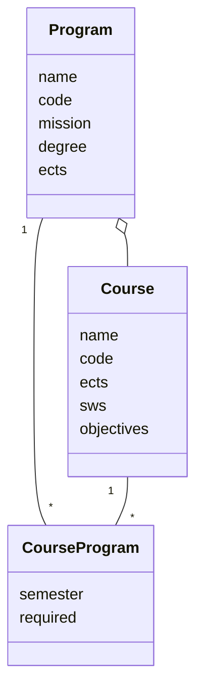

The Module Handbook is based on a simple core Model: Programs (Studiengänge) can have many Courses (Module), 
and the link is represented by the Model Class "CourseProgram" which describes the connection between a Course and
a Program, adding the information of "semester" and "required" to this associations.

This way, Courses can be part of more than one Program, in different semesters, as required or elective Course.

